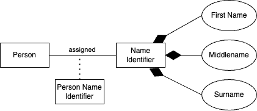

# Coding

This section discuss the techniques for creating application that connect to SQL database.

## Drivers

Here's a list of some of the most common relational databases and their popular Go drivers that fully support the database/sql transaction model:

* **PostgreSQL**:
  * `github.com/lib/pq` (older, but widely used)
  * `github.com/jackc/pgx/v5` (more modern, feature-rich, often preferred now)
* **MySQL / MariaDB**:
  * `github.com/go-sql-driver/mysql`
* **SQLite**:
  * `github.com/mattn/go-sqlite3` - C based.
  * `modernc.org/sqlite` - CGO free.
* **Microsoft SQL Server**:
  * `github.com/denisenkom/go-mssqldb`
* **Oracle Database**:
  * `github.com/go-godbc/godbc` (or other commercial/community drivers)

## Postgres

This section describes techniques for coding SQL programming against Postgres.

### Working Example 1: Pinging Postgres

This [example](../examples/coding/pg/ex1/main.go) involves establishing a connection with a Postgres server and followed by a ping.

### Working Example 2: Simple CRUD for Postgres

This [example](../examples/coding/pg/ex2/main.go) illustrate the process to create table, inserting data, querying and dropping table.

## SQLite

This section describes techniques for coding SQL programming against SQLite.

### Working Example 1: Simple CRUD for SQLite

This [example](../examples/coding/sqlite/ex1/main.go) illustrate the process to instantiate a SQLite server, create table, inserting data, querying and dropping table.

### Working Example 2: This demonstrates transactions

This [example](../examples/coding/sqlite/ex2/main.go) illustrates a table with only Primary key and the process uses transactions to insert data commit.

### Working Example 3: Mapping SQLite data to Go custom type

This example is based on this logical schema.

.

The SQL specification of the schema are based on these files:

* [Person Table](../internal/person/sql/sqlite/tbl_person.sql)
* [Name ID Table](../internal/person/sql/sqlite/tbl_named_id.sql)
* [Person Name ID Table](../internal/person/sql/sqlite/tbl_person_name_id.sql)

Here is [the implementation](../examples/coding/sqlite/ex3/main.go)
