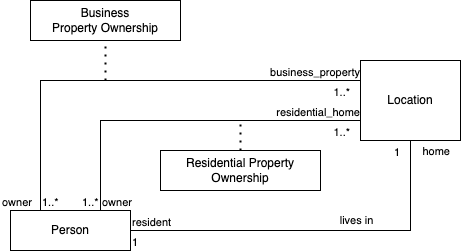

# Data Model

This section contains a list of data models (logical amd schema) we'll use a basis to implement as working examples.

## Example 1: Property Ownership Domain

This example is based on property ownership domain.

### Logical model

### Relational schema
