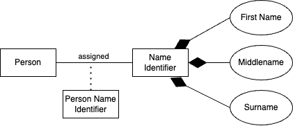

# Goose

Goose is a database migration cli tool and Go library to manage schema evolution through SQL scripts or Go code.

## Use Case

It fills the role of managing **database schema and versioning** but it does not move data across servers.

### Schema Migration

Goose is most commonly used to automate changes to a database's structure, ensuring the production database stays in sync with the application's code.

* **Version Control:** It treats your database like a Git repository, where each SQL file is a "commit" that moves the schema from version A to version B.

* **Traceability:** It maintains a *goose_db_version* table inside your database, allowing teams to see exactly when specific structural changes (like adding a new table or column) were applied.

### Data Migration (Record Changes)

Goose is unique among many migration tools because it supports **Go-based migrations** in addition to SQL. This makes it powerful for the "data" part of migration:

* **Complex Logic:** While SQL is great for adding columns, Go code can perform complex data transformations, such as decrypting records, calling external APIs, or moving data between tables while restructuring them.

* **Seeding:** It can be used to "seed" a database with initial required data (like country codes or default admin roles) after a new environment is created.

* **Atomic Updates:** In 2026 workflows, Goose is often used for "staged migrations" where you perform a schema change (adding a nullable column), a data migration (populating that column), and a final schema change (making the column non-nullable) in sequence

The support for **Go-based migrations** means that you can write migration logic using pure Go code instead of (or in addition to) standard SQL files.

Unlike SQL migrations which are read and executed by the Goose CLI, Go migrations are functions that must be compiled into a binary to run.

* **Registration:** You define functions for Up and Down logic and register them using goose.AddMigration.

* **Transaction Support:** Go migration functions receive a *sql.Tx (SQL transaction) as an argument, ensuring that your custom logic and the version tracking update succeed or fail together.

**Custom Binary:** Because the standard Goose CLI cannot execute arbitrary Go code, you typically create a custom migration binary in your project that imports the Goose library and your migration files.

When to use **Go-based migration**?

* **Data Transformation:** Moving data from one column to another while changing the format (e.g., parsing a JSON string into individual columns).
Seeding Data: Dynamically generating and inserting initial administrative or test data.

* **External Integration:** Notifying a third-party service (like a search index or cache) that a database change has occurred during the migration process.

* **Embedding:** If you want to ship your application as a single executable that includes all its migrations, using Go migrations allows you to embed the logic directly into the compiled binary.

## Postgres

Here are my notes on the use Goose to migrate Postgres schema.

### Working Example 1: Using CLI

In this example, we are using goose cli to create tables. The schema is based on a logical model, expressing a domain where a person has multiple names as summarised below:

The database schema is specified across these files:

* [Base Table specification](../examples/goose/pg/ex1/migrations/2026010123201_create_base_tables.sql)
* [Add columns](../examples/goose/pg/ex1/migrations/2026010123202_add_columns.sql)
* [Add constrains](../examples/goose/pg/ex1/migrations/2026010123203_add_constraints.sql)

The steps to run the cli is [embedded in this script](../examples/goose/pg/ex1/script.sh).

## Working Example 2: Basic Go Migration

In this example, we are writing Go application to execute schema migration. The migration files are here:

* [SQL migration create base table](../examples/goose/pg/ex2/2026010218301_create_base_table.sql)
* [Migration in Go rename column](../examples/goose/pg/ex2/2026010218302_rename_column.go)

This is the [main routine](../examples/goose/pg/ex2/main.go). To run the process, you need to build an executable.
