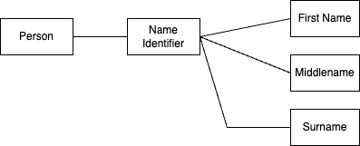

# Working Examples

* [Local Data Model](#logical-data-model)
* [Phyical Data Model](#physical-data-model)
* [PostgreSQL Working Examples](#postgresql-working-examples)
* [SQLite Working Examples](#sqlite-working-examples)

## Logical Data Model

A logical data model represents relationships between entitiess, aggregates of entities and object values of a particular business domain. For the purpose of this project our SQL models are derived from these logical models.

### Person identifier domain

Entities:

* Person

Value objects:

* First Name
* Middle Name
* Surname

## Physical Data Model

The physical data model is a translation of the logical model in forms that can be stored in digital format.

### Person

* [Go based data model](../internal/person/doc.go)
* [SQL based data model](../internal/person/sql/doc.md)

## Go Common Packages

* [./internal/sqlops](../internal/sqlops/doc.go) - A collection of common SQL operations.

## PostgreSQL Working Examples

To run these working examples, you will need to run an instance of Postgres, you will find a working setup [https://github.com/paulwizviz/learn-postgres](https://github.com/paulwizviz/learn-postgres)

* [Example 1](../examples/pg/ex1/main.go) demonstrates a simple operation to ping with posstgres instance.

## SQLite Working Examples

* [Example 1](../examples/sqlite/ex1/main.go) - demonstrates steps to create, insert and query in memory database using raw Go SQL driver
